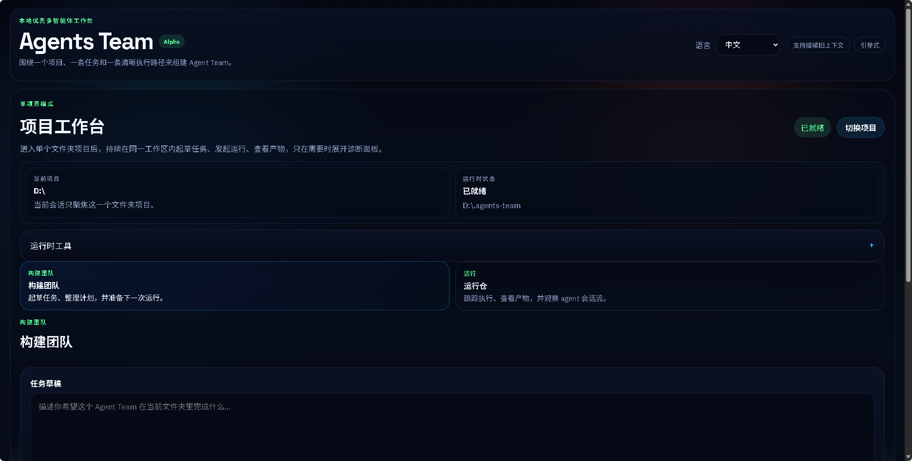

# 读前须知 📌

​	在码农正在变成夕阳行业的今天，抱着“打不过就加入”的心态，参考了 gstack 的 Skills 思路，借助 Codex 尝试了一次几乎完全由自然语言驱动的编程实践。除了这段说明，整个项目基本都由 Codex 协助完成。🤖

​	于是有了 **agents_team**：一个基于 Codex 构建的智能体团队协作工具，用多个 Agent 按流程协同处理任务。🧩

​	目前项目还比较脆弱，更多算是一次自娱自乐式的探索。但它已经可以按照既定流程，在本地调度多个智能体，完成基础计算器这类简单代码任务的编写与运行。🚀

​	后续我会持续优化，比如扩展大模型接口支持 DeepSeek、将项目改造成可在服务器环境中运行等。归根结底，如何适应纯自然语言编程，并在这个过程中持续学习、迭代和进步，可能才是卑微的码农面向未来的重要出路。🌱

​	如果这个思路对你有启发，欢迎点个 Star！⭐

# 🤝 agents_team

`agents_team` is a **local-first multi-agent code collaboration workbench** for coordinating Codex-powered engineering workflows.

It fills a practical gap in today’s Codex usage: you can run multiple conversations, but they do not naturally coordinate, share workflow state, or behave like an explicit team. `agents_team` turns those isolated sessions into a persistent, project-aware workbench.



## ✨ What it does

This repository contains the first product skeleton:

- 🖥️ **Browser workbench** for opening one project folder, drafting tasks, and staying in one persistent workspace
- ⚙️ **FastAPI backend** for orchestration, local filesystem access, and Codex integration scaffolding
- 🧠 **Project-local runtime state** stored under `.agents-team/`

## 🧭 Product direction

V1 focuses on **code-task collaboration**:

- 🏠 Local-first by default
- 📁 Single-project workbench flow
- 🔒 Strict workflow collaboration
- 🤖 Auto-generated agent teams
- ✍️ Direct file editing by agents
- 👤 Human-controlled Git actions
- 👀 Read-only Codex config visibility
- 🔁 Codex session reuse where possible

## 📂 Repository layout

```text
frontend/   React + Vite workspace
backend/    FastAPI service and orchestration skeleton
docs/       Architecture and product notes
```

## 🚀 Quick start

### Backend

```powershell
python -m venv backend/.venv
backend/.venv/Scripts/Activate.ps1
python -m pip install --upgrade pip
python -m pip install -e ./backend
uvicorn app.main:app --reload --app-dir backend
```

Linux/macOS:

```bash
python -m venv backend/.venv
source backend/.venv/bin/activate
python -m pip install --upgrade pip
python -m pip install -e ./backend
uvicorn app.main:app --reload --app-dir backend
```

### Frontend

```powershell
cd frontend
npm install
npm run dev
```

The frontend uses relative `/api` requests in development, and Vite proxies them to the backend dev server.

### Dev launcher

```powershell
powershell -ExecutionPolicy Bypass -File scripts/dev-up.ps1
powershell -ExecutionPolicy Bypass -File scripts/dev-status.ps1
powershell -ExecutionPolicy Bypass -File scripts/dev-down.ps1
```

## 🔌 Current backend endpoints

### Health and Codex

- `GET /api/health`
- `GET /api/codex/summary`

### Projects

- `GET /api/projects/discovered`
- `GET /api/projects/roots`
- `GET /api/projects/recent`
- `POST /api/projects/workspaces/open`
- `POST /api/projects/pick`
- `GET /api/projects/tree?path=<project-dir>`

### Runtime state

- `GET /api/projects/runtime?path=<project-dir>`
- `POST /api/projects/runtime/init`
- `POST /api/projects/runtime/mirror`
- `POST /api/projects/runtime/export`
- `POST /api/projects/runtime/import`

### Workflows

- `POST /api/workflows/plan`
- `POST /api/workflows/runs`
- `GET /api/workflows/runs?project_path=<project-dir>`
- `GET /api/workflows/runs/{run_id}`
- `DELETE /api/workflows/runs/{run_id}`
- `POST /api/workflows/runs/{run_id}/execute`
- `GET /api/workflows/runs/{run_id}/log`
- `GET /api/workflows/runs/{run_id}/artifacts`
- `GET /api/workflows/runs/{run_id}/context-audits`
- `GET /api/workflows/runs/{run_id}/events`
- `POST /api/workflows/runs/{run_id}/cancel`
- `POST /api/workflows/runs/{run_id}/approve-dangerous`
- `POST /api/workflows/runs/{run_id}/resume`
- `POST /api/workflows/runs/{run_id}/retry`
- `GET /api/workflows/runs/{run_id}/agent-sessions`
- `GET /api/workflows/queue`

## 🗂️ Local runtime state

Managed projects get a hidden control directory:

```text
<project>/.agents-team/
```

It is designed to hold:

- 🧾 Project-local metadata
- 🏃 Workflow runs
- 📊 Reports
- 📦 Artifact indexes
- 🧠 Project memory
- 🪵 Logs

The app may also use a global home directory under the user’s home directory.

## 🧩 Workflow engine highlights

The workflow system is built around persistent, inspectable execution:

- ✅ Step-level execution state, attempt counts, cancellation metadata, logs, reports, artifact bundles, and realtime events are persisted under project-local runtime state.
- 🧱 Runs enter a global SQLite-backed queue before worker execution, making queued and running work recoverable across backend restarts.
- 🗃️ Run metadata, step ledger state, and cross-project lookup metadata live in the same control-plane SQLite store.
- 🧠 Runs recall project/global memory at creation time, inject that context into workflow execution, and write fresh handoff memory on terminal states.
- 🧪 Matrix-style verification can run branches in parallel before review and reporting rejoin the graph.
- 🚧 Command-backed steps pause behind explicit dangerous-command approval gates before execution, resume, or retry.

## 🛡️ Safer Codex execution

Codex-backed workflow steps do **not** run directly inside the real project tree. Instead, they execute in isolated context workspaces under the global app home.

Those workspaces include:

- Projected source files for edit-capable steps
- Generated `.agents-context/` state files for machine-readable handoffs
- JSON contracts such as `research-result.json`, `verify-summary.json`, `review-result.json`, and `final-state.json`
- Human-facing markdown artifacts derived from those contracts

Every Codex-backed step also writes a context-audit record so the backend can track which structured sources were exposed, how many bytes were included, and whether forbidden raw workflow files were requested. When upstream `codex exec --json` usage data is available, those records also capture token usage.

## 🧠 Memory, reuse, and short-circuiting

Research can now detect when a task is already covered by a recent successful run or already satisfied by the current project state. In that case, the workflow skips unnecessary execution, still produces a final handoff, and records the run as `short_circuited`.

For near-duplicate tasks that need only a small follow-up, research can emit `continue_with_delta`. The scheduler then preserves the run, persists a structured delta scope, rewrites later step goals, trims command previews, and narrows verification lanes to the remaining work.

High-signal research and verification findings can also be promoted into reusable global rules, giving future workflow planning stronger cross-project guidance.

## 🧭 Workbench experience

The browser UI is designed as a continuous single-project workbench:

- 🌐 Bilingual UI text
- 🚪 Launcher + persistent project workspace flow
- 📌 Path-first project opening and switching
- 🧭 Recent project registry, URL-preserved view state, and backend-host folder browsing fallback
- 🧰 Runtime tools, task drafting, run orchestration, artifacts, quick switching, and diagnostics in one place

The workbench separates its two primary jobs into full-width sections:

1. **Build the team and shape the next run**
2. **Operate the run cockpit**

The cockpit includes a chat-style agent session view, structured event timelines, Codex-like thinking/final turn presentation, command activity, stage-specific result cards, and compact trace summaries for oversized stdout/stderr blocks.

## 📚 Artifacts and diagnostics

Artifacts are designed to be readable and auditable:

- Markdown artifacts render with headings, lists, quotes, and code blocks
- A cross-document navigator, previous/next actions, and heading outline improve longer artifact reading
- Parallel-branch summary documents make matrix verification easier to inspect
- Context audits expose per-step model context summaries
- Queue diagnostics surface active work, recent terminal items, worker health, expired leases, and recoverable stale claims

## 🤖 Role-scoped workflow backends

The strict workflow now has explicit role-scoped backends for:

- Planner
- Research
- Implement
- Verify
- Review
- Report

Planner, reviewer, reporter, research, and verify each attempt delegated non-interactive Codex execution first, with local fallback behavior preserved when Codex is unavailable. Each step is tracked as its own agent session and coordinated by the persistent SQLite queue-backed worker.

## 🧬 Codex integration stance

The current integration strategy is:

- Prefer Codex CLI and server-style integration where possible
- Reuse resumable sessions when stable enough
- Avoid making Codex internal session files the only source of truth
- Keep Codex config handling read-only in V1

For more detail, see [docs/ARCHITECTURE.md](docs/ARCHITECTURE.md).
